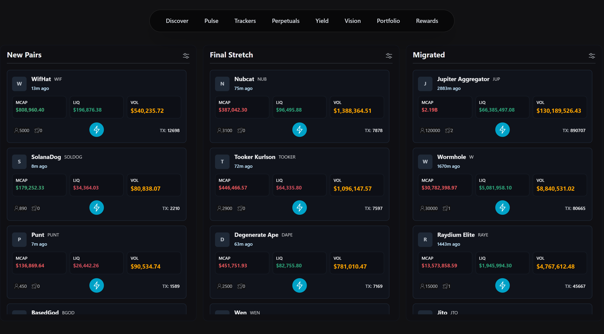
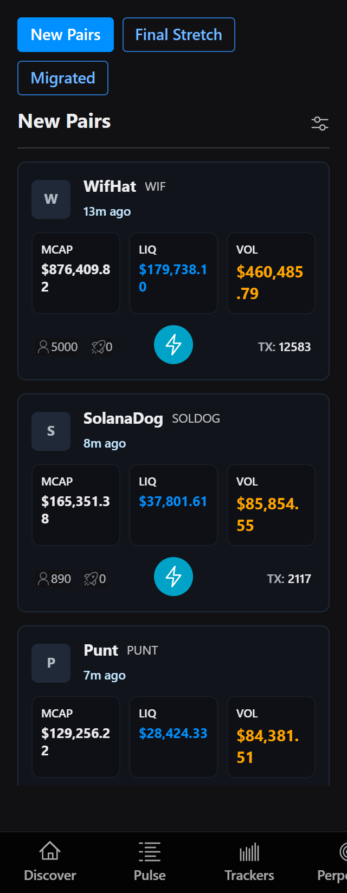
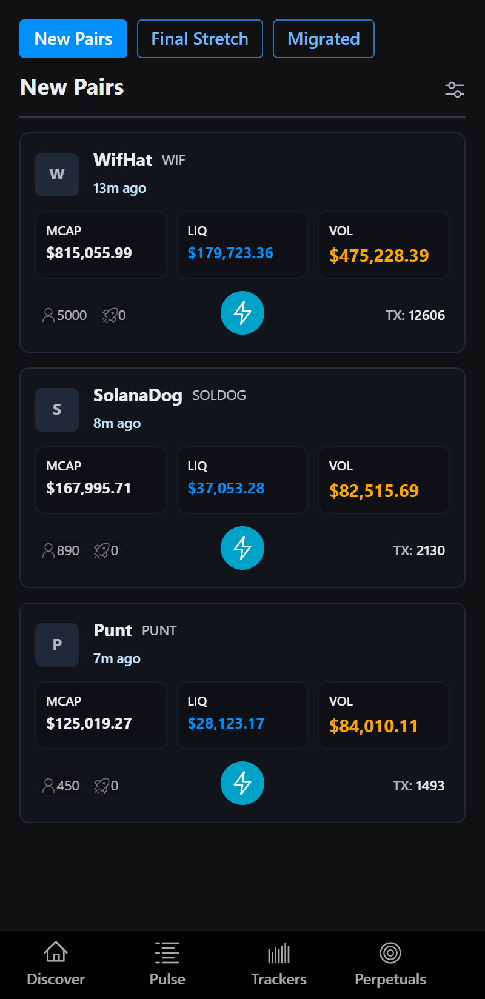
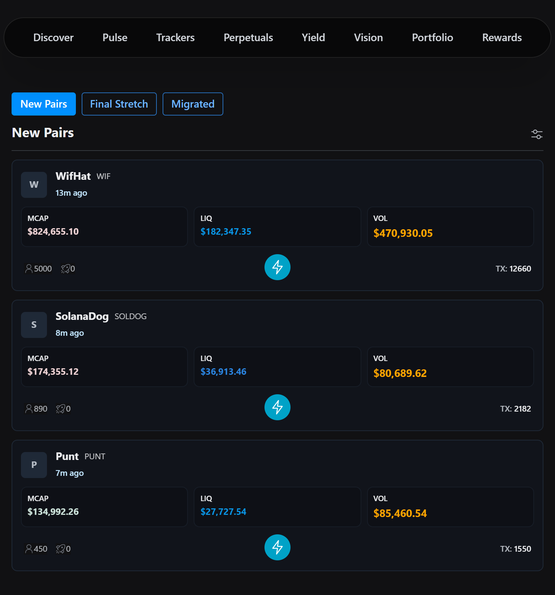
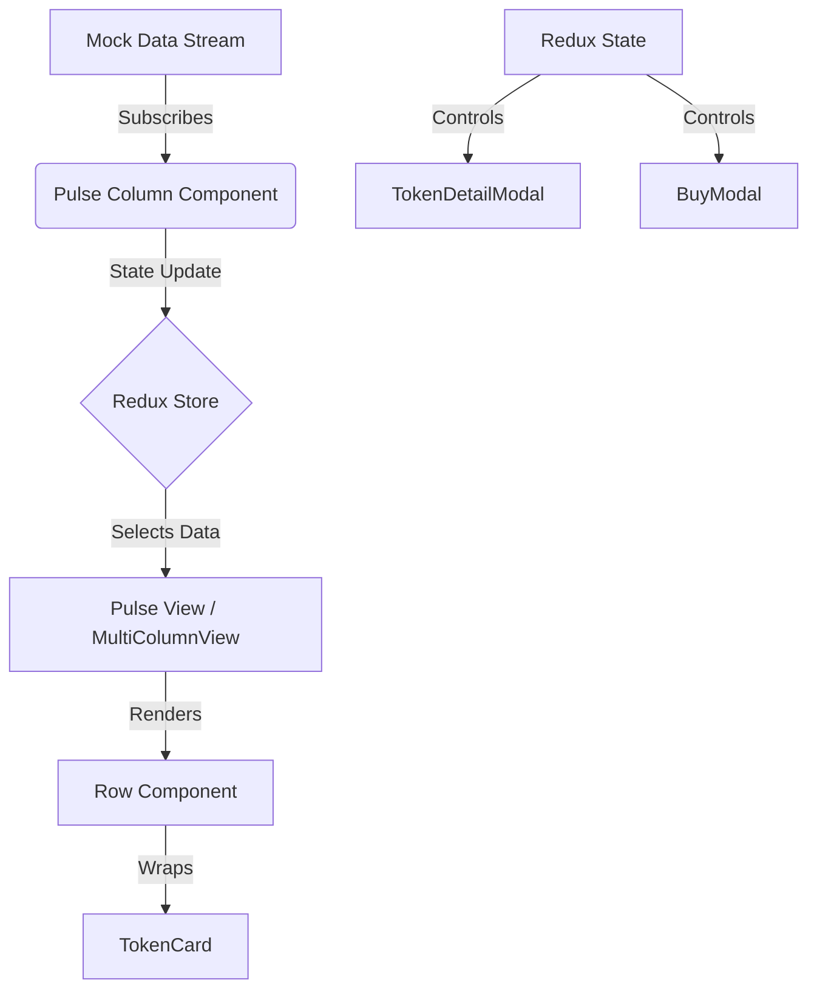

# Axiom Pulse Clone


### [🚀 **View Live Demo**](https://axiom-pulse-clone-one.vercel.app/)

## Snapshots

**Desktop View (1500px)**


**Responsive Mobile & Tablet Views**
| Mobile (320px) | Mobile (400px) | Tablet (768px) |
| :---: | :---: | :---: |
|  |  |  |


A high-performance, real-time cryptocurrency dashboard clone built with **Next.js 14**, **Redux Toolkit**, and **Radix UI**. This project simulates a live trading environment with dynamic data streaming, responsive layouts, and optimized rendering.

## 🚀 Features

-   **⚡ Real-Time Data Stream**: Simulates high-frequency updates for market cap, liquidity, and volume.
-   **📱 Responsive & Adaptive Layout**:
    -   **Mobile**: Tabbed navigation for "New Pairs", "Final Stretch", and "Migrated" columns.
    -   **Desktop**: Unified Multi-Column Grid view for monitoring all segments simultaneously.
-   **🚀 High Performance**: Uses `react-virtuoso` for efficient list virtualization, handling large datasets smoothly.
-   **✨ Interactive UI**:
    -   "Flash" animations (Green/Red) on value updates.
    -   Generic **Sort & Filter** functionality.
    -   **Token Details Modal** with deep-linkable states (managed via Redux).
    -   **Buy Modal** for simulating transactions.
-   **🛠️ Clean Architecture**:
    -   Reusable components (`TokenCard`, `BuyModal`) in `src/components/shared`.
    -   Centralized state management with Redux slices.
    -   Custom Hooks (`useDirectFlash`, `useTokenDetails`) for logic separation.

## 🛠️ Tech Stack

| Category | Technologies |
| :--- | :--- |
| **Framework** | [Next.js 14](https://nextjs.org/) (App Router) |
| **Language** | [TypeScript](https://www.typescriptlang.org/) |
| **Styling** | [Tailwind CSS](https://tailwindcss.com/) & [Radix Themes](https://www.radix-ui.com/) |
| **State Management** | [Redux Toolkit](https://redux-toolkit.js.org/) |
| **Icons** | [Radix Icons](https://icons.radix-ui.com/) |
| **Performance** | [React Virtuoso](https://virtuoso.dev/) |

## 📂 Project Structure

```bash
src/
├── app/                  # Next.js App Router pages
├── components/
│   ├── pulse/            # Pulse-specific features (Row, Column)
│   ├── shared/           # Reusable components (BuyModal, SortFilter)
│   └── ui/               # Generic UI building blocks (TokenCard, MultiColumnView)
├── hooks/                # Custom React hooks (useDirectFlash)
├── lib/                  # Utilities (mock stream, formatting)
├── store/                # Redux store and slices
└── styles/               # Global styles & Tailwind config
```

## 🏗️ Architecture



## 🚀 Getting Started

1.  **Clone the repository**:
    ```bash
    git clone https://github.com/brainDensed/axiom-pulse-clone.git
    cd axiom-pulse-clone
    ```

2.  **Install dependencies**:
    ```bash
    npm install
    # or
    yarn install
    ```

3.  **Run the development server**:
    ```bash
    npm run dev
    ```

4.  Open [http://localhost:3000](http://localhost:3000) in your browser.

## 💡 Best Practices Implemented

*   **Component Reusability**: Common patterns (Cards, Modals, Loading Skeletons) are extracted into `shared/` and `ui/` directories to be used across different feature sections.
*   **Virtualization**: Infinite lists are rendered using virtualization to maintain 60 FPS scrolling even with thousands of items.
*   **Optimized Re-renders**: Heavy computations are memoized (`useMemo`, `useCallback`) and components are wrapped in `React.memo`.
*   **Direct DOM Manipulation**: The `useDirectFlash` hook uses refs for high-frequency price flash animations to avoid expensive React reconciliation cycles.

---

*Built with ❤️ by Shivam*
